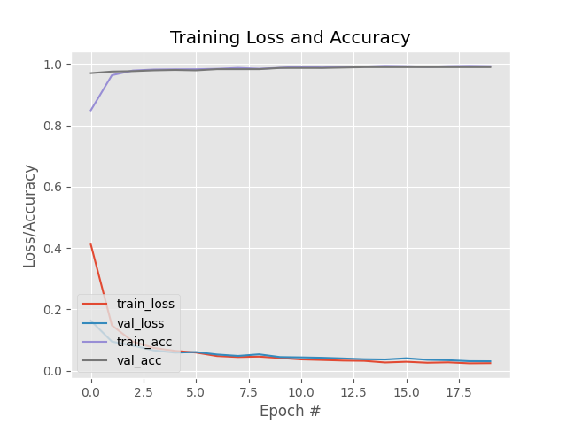

# 🛡️ Face Mask Detection with Deep Learning

This project implements a **real-time face mask detection system** using deep learning and computer vision. It uses **TensorFlow**, **Keras**, **OpenCV**, and **MobileNetV2** to detect whether people in a live webcam stream are wearing a face mask or not.

---

## 📌 Table of Contents

- [Demo](#-demo)
- [Project Structure](#-project-structure)
- [Dataset](#-dataset)
- [Model Architecture](#-model-architecture)
- [Installation](#-installation)
- [Training the Model](#-training-the-model)
- [Running the Detector](#-running-the-detector)
- [Results](#-results)
- [Requirements](#-requirements)

---

## 🎥 Demo



---

## 🧠 Model Architecture

The model is based on **MobileNetV2** pre-trained on ImageNet for feature extraction. We added a custom classification head:

- `AveragePooling2D`
- `Flatten`
- `Dense` layer with ReLU
- `Dropout` for regularization
- Final `Dense` layer with Softmax for binary classification (Mask / No Mask)

All base layers are **frozen** during training to speed up training and preserve learned features.

---

## 🗂️ Dataset

The dataset is structured like this:

dataset/

├── with_mask/

└── without_mask/


Each folder contains images of faces either **with** or **without** masks. The images are resized to `(224, 224)` and preprocessed using MobileNetV2’s `preprocess_input`.

---

## ⚙️ Installation

1. **Clone the repository**:
   ```bash
   git clone https://github.com/sohail22515/Face-Mask-Detection.git
   cd Face-Mask-Detection

2. **Create a virtual environment:**
   ```bash
     python -m venv tf-env
     source tf-env/bin/activate   # macOS/Linux
   
3. **Install Dependencies:**
     pip install -r requirements.txt

---

## 🏋️ Training the Model
    ```bash
      python train_mask_detector.py


## Running the Real-Time Mask Detector
  ```bash
      python detect_mask_video.p
